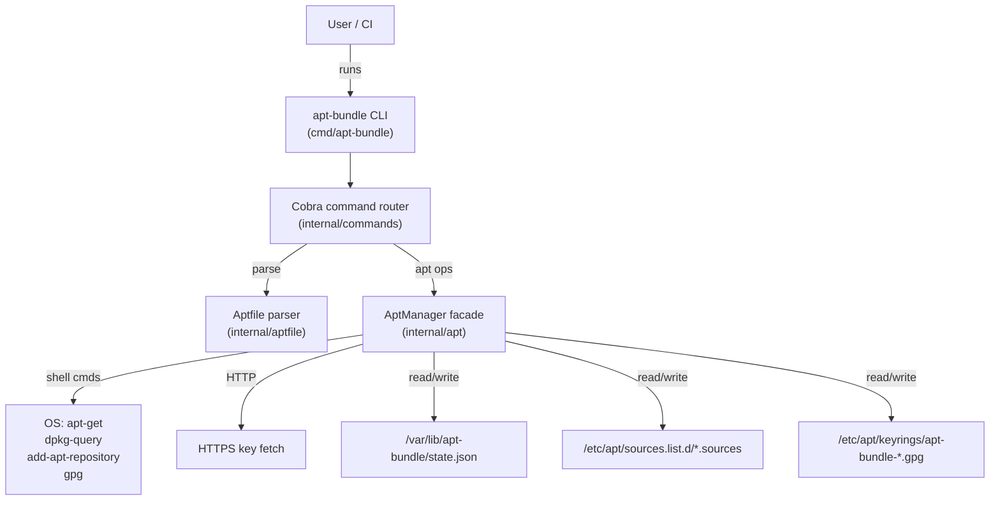
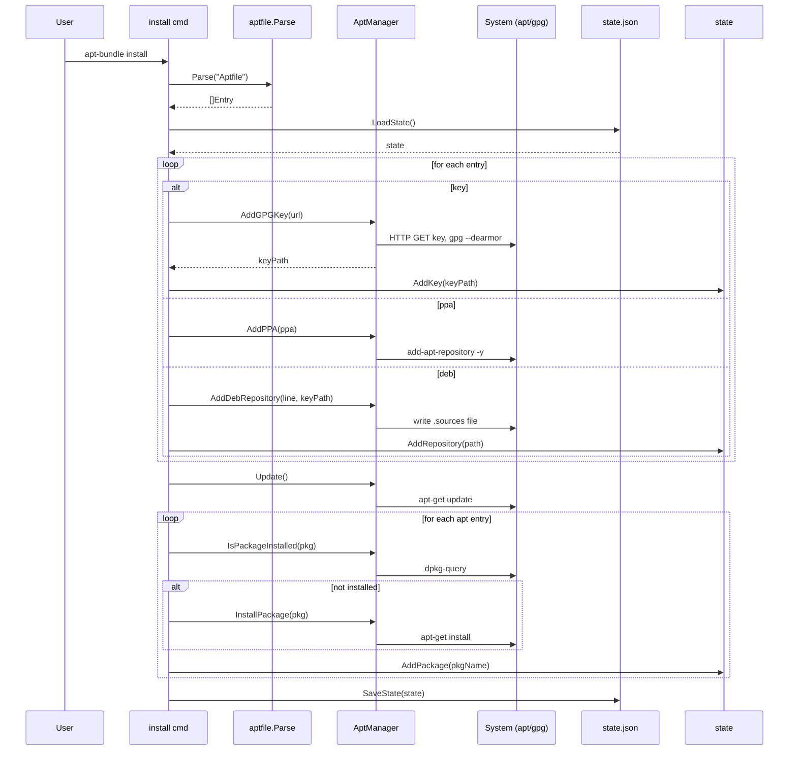
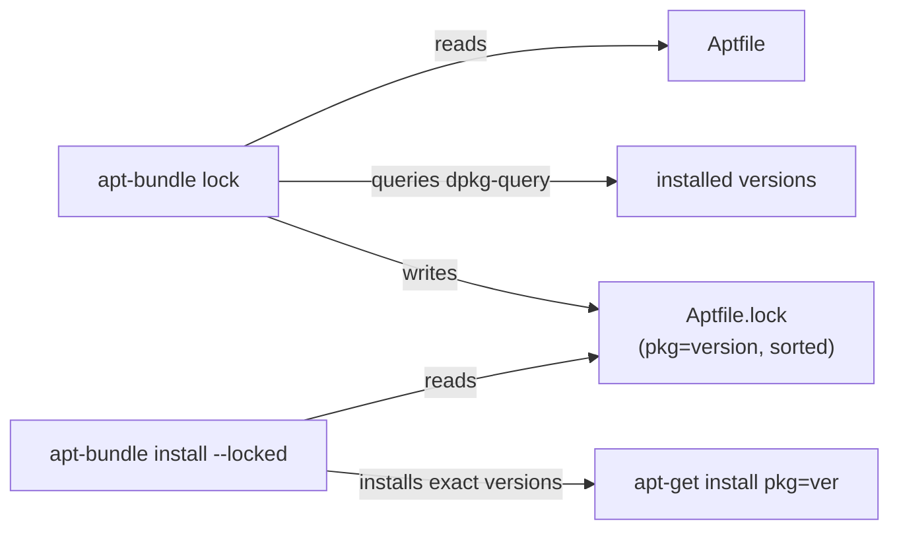
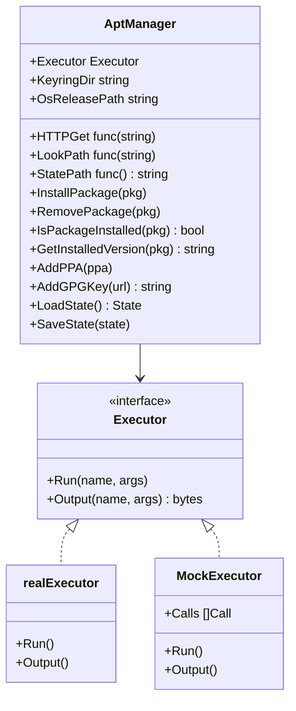
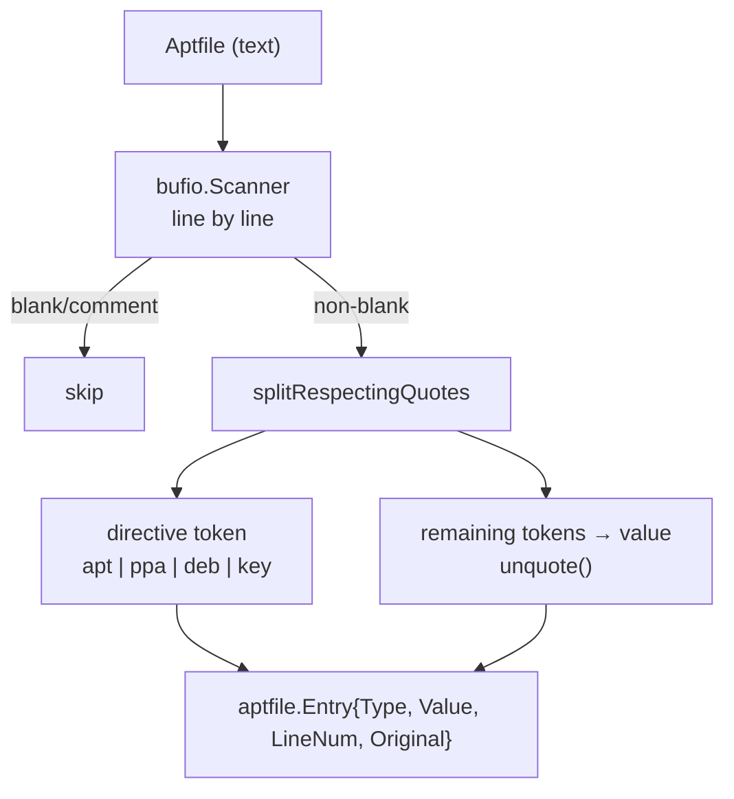
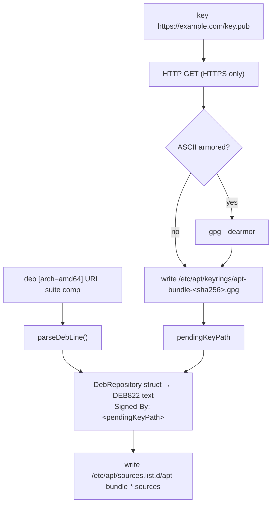

# Architecture

This document describes the internal design of `apt-bundle` for contributors and anyone who wants to understand how the tool works.

---

## Motivation

Managing system packages on Debian/Ubuntu machines is inherently imperative: you run `apt-get install foo`, and if the state of the machine drifts, you have no easy way to reconstruct it. Common workarounds all have drawbacks:

| Approach | Problem |
|---|---|
| Bash install scripts | Hard to make idempotent; repository/key management is brittle |
| `dpkg --get-selections` | Machine-generated, doesn't capture PPAs or custom repos, not shareable |
| Ansible/Chef | Heavy; requires learning a DSL or YAML schema just to install packages |
| Nix | Full paradigm shift away from the existing `apt` ecosystem |

`apt-bundle` is modeled on [Homebrew Bundle](https://github.com/Homebrew/homebrew-bundle): a thin declarative layer on top of an existing package manager. The goal is a single human-readable file (`Aptfile`) that you can commit to a repo and reproduce the system's package state anywhere — on a new developer laptop, in a Dockerfile, or in CI.

### Core Requirements

1. **Declarative**: All desired state lives in one file (`Aptfile`).
2. **Idempotent**: Running the tool multiple times has the same result as running it once.
3. **Complete**: Covers not just packages, but also PPAs, custom `deb` repositories, and GPG keys.
4. **Safe cleanup**: Remove only what the tool itself installed; never touch packages the user added manually.
5. **CI-friendly**: Machine-readable output, meaningful exit codes, lock-file support for reproducible builds.
6. **No external runtime dependencies**: Single static binary; no Python, no Ruby, no daemons.

---

## High-Level Design

### System Overview



### Package Layout

```
apt-bundle/
├── cmd/apt-bundle/        # main() — thin wrapper, sets exit code
├── internal/
│   ├── aptfile/           # Aptfile format: types + parser
│   ├── apt/               # All APT interactions (packages, repos, keys, state)
│   └── commands/          # One file per CLI subcommand
├── specs/                 # Requirements and technical spec (non-code)
└── examples/              # Docker usage examples
```

The `internal/` prefix is intentional — nothing outside this module imports these packages. All public API surface is the CLI itself.

### Command Inventory

| Command | Requires root | Reads state | Writes state | Key behavior |
|---|---|---|---|---|
| `install` (default) | Yes | Yes | Yes | Add repos/keys → `apt-get update` → install packages |
| `sync` | Yes | Yes | Yes | `install` + remove packages in state but not Aptfile |
| `check` | No | No | No | Verify presence; JSON output; exits 1 if missing |
| `cleanup` | Yes | Yes | Yes | Remove state-tracked packages no longer in Aptfile |
| `dump` | No | No | No | Generate Aptfile from current system to stdout |
| `doctor` | No | No | No | Validate Aptfile syntax + check environment health |
| `outdated` | No | No | No | List upgradable Aptfile packages; exits 1 if any |
| `lock` | No | No | No (writes `Aptfile.lock`) | Snapshot installed versions |

### The Aptfile Format

The Aptfile is a line-oriented text file with four directive types:

```aptfile
# Comments are ignored; blank lines are skipped

# Install a package at the latest available version
apt curl

# Install a pinned version
apt "nano=2.9.3-2"

# Add a PPA (Ubuntu-specific; uses add-apt-repository)
ppa ppa:ondrej/php

# Download a GPG key for a custom repo (HTTPS only)
key https://download.docker.com/linux/ubuntu/gpg

# Add a custom repository (traditional deb-line syntax)
deb "[arch=amd64] https://download.docker.com/linux/ubuntu focal stable"
```

The ordering of `key` before `deb` is significant: the parser tracks a `pendingKeyPath` that gets consumed when the next `deb` entry is processed, associating the key with the repository via `Signed-By`.

### Persistent State

`apt-bundle` maintains a JSON file at `/var/lib/apt-bundle/state.json` to track what it has installed. This is the mechanism that makes `cleanup` and `sync` safe — the tool only removes packages/repos/keys that appear in this state, never touching things installed by the user or other tools.

```json
{
  "version": 1,
  "packages": ["curl", "vim", "docker-ce"],
  "repositories": ["/etc/apt/sources.list.d/apt-bundle-docker.sources"],
  "keys": ["/etc/apt/keyrings/apt-bundle-a3f9b1c2.gpg"]
}
```

### Data Flow: `install` Command



### Lock File Workflow



`Aptfile.lock` is a simple `name=version` text file, one entry per line. It is generated from the _currently installed_ versions (not from apt-cache candidate versions), so it captures exactly what is running.

---

## Deep Dives

### `AptManager`: Dependency Injection Facade

`AptManager` (`internal/apt/manager.go`) is the central seam between the command logic and the OS. Its fields are all injectable:

```go
type AptManager struct {
    Executor      Executor             // Run / Output shell commands
    HTTPGet       func(string) (*http.Response, error)
    KeyringDir    string               // default: /etc/apt/keyrings
    LookPath      func(string) (string, error)  // exec.LookPath
    OsReleasePath string               // default: /etc/os-release
    StatePath     func() string        // returns path to state.json
}
```

In production, `NewAptManager()` fills these with real implementations. In tests, each field can be replaced with a mock or a temp-dir path without starting a subprocess. This makes the entire core testable on any platform (including macOS CI runners) without root access.



### Aptfile Parser

`internal/aptfile/parser.go` implements a straightforward line-by-line scanner:

1. Skip blanks and `#` comments.
2. Tokenize each line with `splitRespectingQuotes` — a hand-rolled quote-aware splitter that handles both `"` and `'`.
3. The first token is the directive (`apt`, `ppa`, `deb`, `key`); the remainder is the value.
4. `unquote` strips outer quote characters from the value.

The `Entry` struct preserves both the parsed value and the `Original` unparsed line (used in `doctor` for precise error reporting).



### Repository and Key Management

**Key flow** (`internal/apt/keys.go`):
- Only HTTPS URLs are accepted (HTTP and `file://` are rejected).
- The tool downloads the key bytes and detects whether they are ASCII-armored (PEM-like `-----BEGIN PGP...`).
- If armored, it shells out to `gpg --dearmor` to produce a binary `.gpg` file.
- Keys are stored in `/etc/apt/keyrings/` with a filename derived from the SHA-256 hash of the URL: `apt-bundle-<hash>.gpg`. This makes keys idempotent — the same URL always produces the same filename.

**Repository flow** (`internal/apt/repositories.go`):
- Traditional `deb [options] URL suite components` lines are parsed by `parseDebLine`.
- The parsed struct is serialized to [DEB822 format](https://repolib.readthedocs.io/en/latest/deb822-format.html) and written as a `.sources` file under `/etc/apt/sources.list.d/`.
- If a `pendingKeyPath` was set by a preceding `key` directive, it becomes the `Signed-By:` field in the DEB822 stanza, scoping the key to this repository only (rather than trusting it system-wide).
- PPAs use `add-apt-repository` and are handled separately — Ubuntu-specific, gated by `isUbuntu()` which reads `/etc/os-release`.



### State Tracking

`internal/apt/state.go` defines a simple versioned JSON document. The `State` struct has three lists: `packages`, `repositories` (file paths), and `keys` (file paths).

State is **additive during install** and **subtractive during cleanup**. The key invariant:

> The tool only removes a package/repo/key from the system if it appears in `state.json`. It never touches entries that aren't there.

`GetPackagesNotIn([]string)` is the workhorse of `sync` and `cleanup`: it computes the set difference between the tracked packages and the current Aptfile, returning what should be removed.

State versioning (`StateVersion = 1`) reserves room for future schema migrations.

### Command Wiring (Cobra)

`internal/commands/root.go` wires up the Cobra command tree. Notably, `install`'s `init()` also sets `rootCmd.RunE = runInstall`, making `install` the implicit default when no subcommand is given:

```bash
sudo apt-bundle          # same as: sudo apt-bundle install
sudo apt-bundle install  # explicit form
```

Global flags (`--file`, `--no-update`) are defined on `rootCmd` and are therefore available to all subcommands via the shared `aptfilePath` and `noUpdate` package-level variables. A package-level `mgr *apt.AptManager` is initialized once in `root.go` and shared by all commands.

### `dump` and `check`: Read-only Introspection

These two commands are the inverse of `install` — they read system state and report it rather than changing it.

**`dump`** (`internal/commands/dump.go`):
- Calls `apt-mark showmanual` to get manually-installed packages.
- Calls `ListCustomSources()` (`internal/apt/sources.go`) which reads both `/etc/apt/sources.list` and `/etc/apt/sources.list.d/` and reconstructs `ppa` and `deb` Aptfile lines from the system.
- Outputs everything to stdout in valid Aptfile format.

**`check`** (`internal/commands/check.go`):
- Parses the Aptfile and checks each entry's presence:
  - `apt`: `dpkg-query` for install status
  - `ppa`/`deb`: scan sources files
  - `key`: `os.Stat` on the expected keyring path
- Supports `--json` for `{"ok": true, "missing": []}` output.
- Exit code 0 only if everything is present — useful as a CI gate.

---

## Orientation for New Features

To illustrate how the layered architecture accommodates new functionality, here are two examples showing where you'd start.

### Example A: `apt-bundle upgrade` — upgrade all Aptfile packages to latest

1. `internal/commands/` — add `upgrade.go` modeled on `install.go`. The command loop calls `mgr.IsPackageInstalled()` and `mgr.GetInstalledVersion()` to build the list of packages that have a newer candidate.
2. `internal/apt/packages.go` — add a method like `GetCandidateVersion(pkg string) (string, error)` using `apt-cache policy`.
3. The `outdated.go` command already does the candidate-vs-installed comparison for display; `resolveOutdated()` logic can be reused, then call `mgr.InstallPackage(pkg=candidate)` for each outdated package.

### Example B: `snap` packages in the Aptfile (`snap firefox`)

1. `internal/aptfile/parser.go` — add `EntryTypeSnap EntryType = "snap"` and the `"snap"` case in `parseLine`'s switch.
2. `internal/apt/` — add a new file (e.g., `snap.go`) with an `InstallSnap(name string) error` method on `AptManager`, using `Executor.Run("snap", "install", name)`.
3. `internal/commands/install.go` — add a `case aptfile.EntryTypeSnap:` branch in the `runInstall` loop.
4. `internal/apt/state.go` — decide if snaps are tracked in the existing `Packages` list or a new `Snaps` list (bump `StateVersion` if you add a field).
5. Update `check.go` and `dump.go` to handle snap entries.

Both features slot cleanly into the existing layered architecture: **parser → command → AptManager method → Executor shell call → state update**.

---

## Key File Reference

| File | Purpose |
|---|---|
| `cmd/apt-bundle/main.go` | Binary entry point; calls `commands.Execute()` |
| `internal/aptfile/parser.go` | Aptfile format definition and parser |
| `internal/apt/manager.go` | `AptManager` struct; dependency injection wiring |
| `internal/apt/executor.go` | `Executor` interface; `realExecutor` implementation |
| `internal/apt/packages.go` | Package install/remove/query operations |
| `internal/apt/keys.go` | GPG key download, dearmor, and storage |
| `internal/apt/repositories.go` | PPA and deb repository management; DEB822 conversion |
| `internal/apt/sources.go` | Read `/etc/apt/sources.list*`; reconstruct Aptfile lines |
| `internal/apt/state.go` | State JSON: load, save, add/remove/query |
| `internal/commands/root.go` | Cobra root; global flags; shared `mgr` instance |
| `internal/commands/install.go` | `install` command; default command |
| `internal/commands/sync.go` | `sync` command (install + cleanup) |
| `internal/commands/cleanup.go` | `cleanup` command; state-driven removal |
| `internal/commands/check.go` | `check` command; JSON output |
| `internal/commands/dump.go` | `dump` command; system → Aptfile |
| `internal/commands/lock.go` | `lock` command; `Aptfile.lock` I/O |
| `internal/commands/outdated.go` | `outdated` command; candidate version comparison |
| `internal/commands/doctor.go` | `doctor` command; Aptfile + environment validation |
| `internal/testutil/mock.go` | `MockExecutor` for unit tests |
